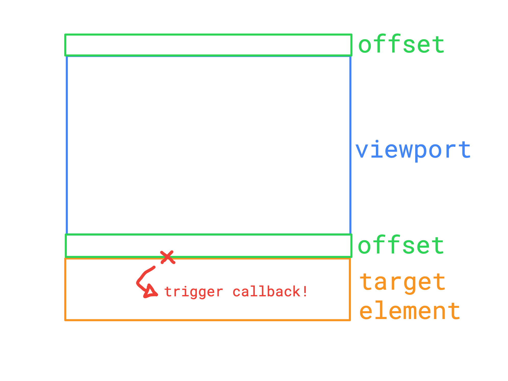
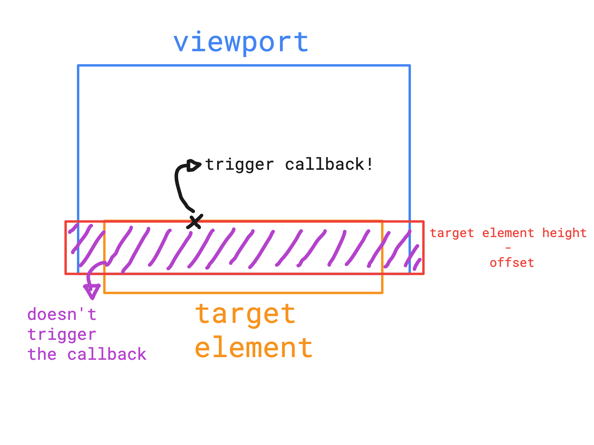

# ScrollSpy 📜🕵️

ScrollSpy can be used to bind a callback function to be called when the element
reaches its scroll position.

It wraps the [Intersection Observer API](https://developer.mozilla.org/en-US/docs/Web/API/Intersection_Observer_API) using the `viewport` as `observer` and the parameter element as `observed`.
The offset values are calculated from top (default) or bottom:


**Top**                                                                           |                                                          **Bottom**
:--------------------------------------------------------------------------------:|:------------------------------------------------------------------:
The `viewport` is expanded vertically by X pixels, being X the offset value.      | The size of the viewport's bottom is reduced by the offset. <br/> To achieve this we calculate `element size - offset` and apply the result as negative margin value.
                                        |                    

## Setup

Install via npm

```sh
npm install @globocom/scrollspy
```

Or include one of the [browser bundles](dist/) via a script tag:

```html
<script src="https://unpkg.com/@globocom/scrollspy@0.1.0/dist/scrollspy.min.js"></script>
```

## Options

```js
ScrollSpy.add({
  el: DOMElement, // required
  callback: Function, // required - A function to be called when the element gets scrolled into the screen
  offset: 200, // An offset (in px) to be considered upon scroll calculation
  reference: "top" // ["top"|"bottom"] Which side to use as base for position calculation
});
```

## Usage

```js
import * as ScrollSpy from "@globocom/scrollspy";

ScrollSpy.add({
  el: document.querySelector(".myDiv"),
  callback: function() {
    // do something
  }
});

ScrollSpy.add({
  el: document.querySelector(".myDiv2"),
  offset: 0,
  callback: function() {
    // do something
  }
});

ScrollSpy.add({
  el: document.querySelector(".myDiv3"),
  offset: 40,
  reference: "bottom",
  callback: function() {
    // do something
  }
});
```

## Debug

There is also available a debug function that highlights `"scrollspied"` elements:

```js
ScrollSpy.debug();
```

## Contributing

This project utilizes [npm run scripts](https://docs.npmjs.com/misc/scripts). See [package.json](package.json) for available scripts.

## License

ScrollSpy is licensed under the [MIT license](LICENSE).
